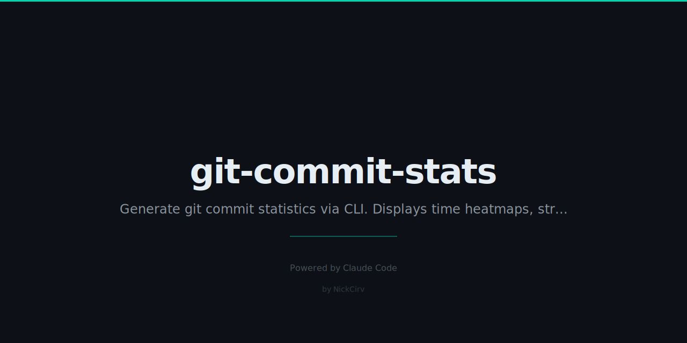

# git-commit-stats

Rich git commit statistics — time heatmaps, streaks, author breakdown, file churn. **Zero external dependencies.**

```
git-commit-stats v1.0.0  —  Branch: main  Since: 2025-01-01

── Commit Frequency ──────────────────────────────────
  Total commits:     142
  Avg per day:       0.93
  Most active day:   2025-03-14 (9 commits)
  Current streak:    3 day(s)
  Longest streak:    12 day(s)

── Time-of-Day Heatmap ───────────────────────────────
  00:00  ░░░░░░░░░░░░░░░░░░░░░░░░░     0
  ...
  19:00  █████████████████████████    41  ◀ peak
  20:00  ████████████████████░░░░░    33
  21:00  ████████████░░░░░░░░░░░░░    20
  ...

── Day-of-Week Heatmap ───────────────────────────────
  Mon  ████░░░░░░░░░░░░░░░░░░░░░    12
  Tue  ██████████░░░░░░░░░░░░░░░    29
  ...
  Sat  █████████████████████████    48

── GitHub-Style Contribution Graph ────────────────────
     ░ ▒ ▓ █ ▒   ░         ░ ▒ ▒   ▓█  ░
Mon
     ░   ▒   ░   ░         ░     ░  █▓
Wed                 ░   ░   ░   ░   ▒ ░
       ░   ░   ░   ░         ░   ░  █▒  ░
Fri  ░   ░   ░   ░   ░   ░   ░   ░ ▒█  ▒
       ░ ▒ ▒ ░ ▒ ▒ ▓ ▒ ▓ ▓ █ ▓ █ █████ ▒

  Less   ░ ▒ ▓ █ More   (142 commits in 52 weeks)
```

## Install

```bash
# Run directly with npx (no install needed)
npx git-commit-stats

# Or install globally
npm install -g git-commit-stats

# Aliases: both work
git-commit-stats --help
gcs --help
```

## Usage

```bash
# Full report for current repo
git-commit-stats

# Filter by date
git-commit-stats --since 2024-01-01
git-commit-stats --since "6 months ago"

# Filter by author
git-commit-stats --author "Alice"

# Specific branch
git-commit-stats --branch main

# Combine filters
git-commit-stats --since "3 months ago" --author "Alice" --branch develop

# Limit author/file lists
git-commit-stats --top 5

# GitHub-style contribution heatmap only
git-commit-stats --format heatmap

# JSON output (pipe to jq, save to file, etc.)
git-commit-stats --format json
git-commit-stats --format json | jq '.frequency.total'
git-commit-stats --format json > stats.json
```

## Options

| Flag | Description | Default |
|------|-------------|---------|
| `--since <date>` | Filter since date (`2024-01-01` or `"3 months ago"`) | All time |
| `--author <name>` | Filter by author name or email | All authors |
| `--branch <name>` | Analyse specific branch | Current branch |
| `--format <mode>` | `default` \| `heatmap` \| `json` | `default` |
| `--top <n>` | Limit author/file lists | `10` |
| `--version`, `-v` | Print version | — |
| `--help`, `-h` | Show help | — |

## Stats Included

| Section | Details |
|---------|---------|
| **Commit Frequency** | Total, avg per day, most active day, current streak, longest streak |
| **Time-of-Day Heatmap** | ASCII bar chart for hours 0–23, peak hour highlighted |
| **Day-of-Week Heatmap** | Mon–Sun bar chart |
| **Top Authors** | Ranked by commit count with % share |
| **File Churn** | Most frequently modified files (top N) |
| **Commit Message Stats** | Avg length, longest message, most common words |
| **Month-over-Month Trend** | Last 12 months bar chart with ▲/▼ trend arrows |
| **Lines Changed** | Additions vs deletions with ratio |
| **Contribution Graph** | GitHub-style 7×52 heatmap using `░▒▓█` blocks |

## Requirements

- Node.js >= 18
- git installed and accessible in PATH
- Run from inside a git repository

## Zero Dependencies

Built entirely on Node.js built-ins: `child_process`, `fs`. No npm install, no supply chain risk, no bloat.

## License

MIT © [NickCirv](https://github.com/NickCirv)
